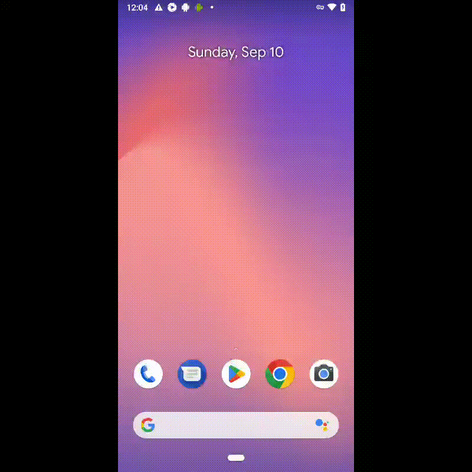

# Проект по автоматизации тестирования мобильного приложения wikipedia

### Технологии и инструменты:
<p align="center">


</p>

### Реализованные проверки:
* Проверка прохождения начальных экранов
* Проверка поиска в приложении
* Проверка поискового запроса

### Запуск тестов из терминала
#### Удаленный запуск тестов в Browserstack:

```bash
gradle ${PLATFORM}_test 
-Denv=${PLATFORM}
```
где:

- <code>PLATFORM</code> – платформа на которой будут выполняться тесты;

### Сборка в Jenkins
<p align="center">

</p>

### Отчет в Allure report
#### Основная страница отчета
<p align="center">

</p>

#### Тест-кейсы
<p align="center">

</p>

### Уведомления в Telegram с использованием бота
<p align="center">

</p>

### Пример видео выполнения теста в Browserstack
<p align="center">
  
</p>
